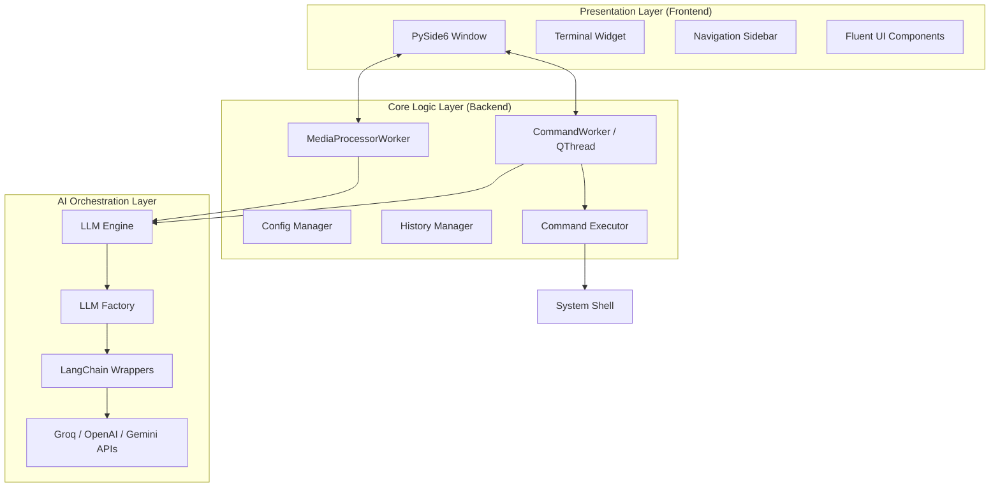
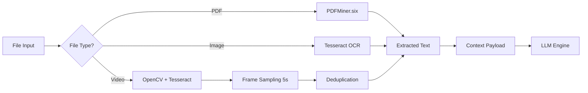
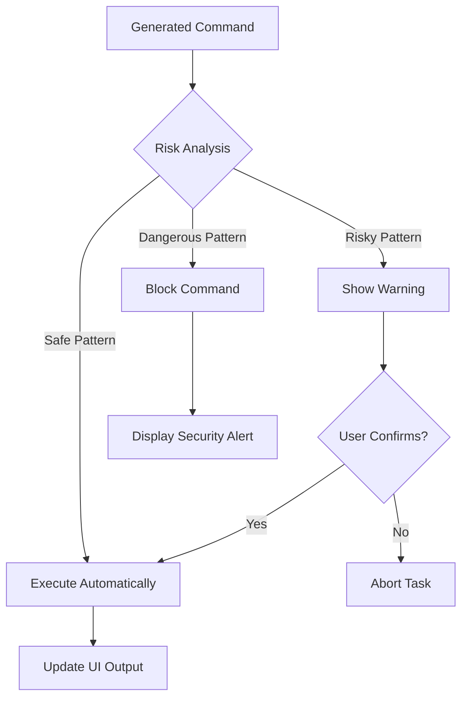
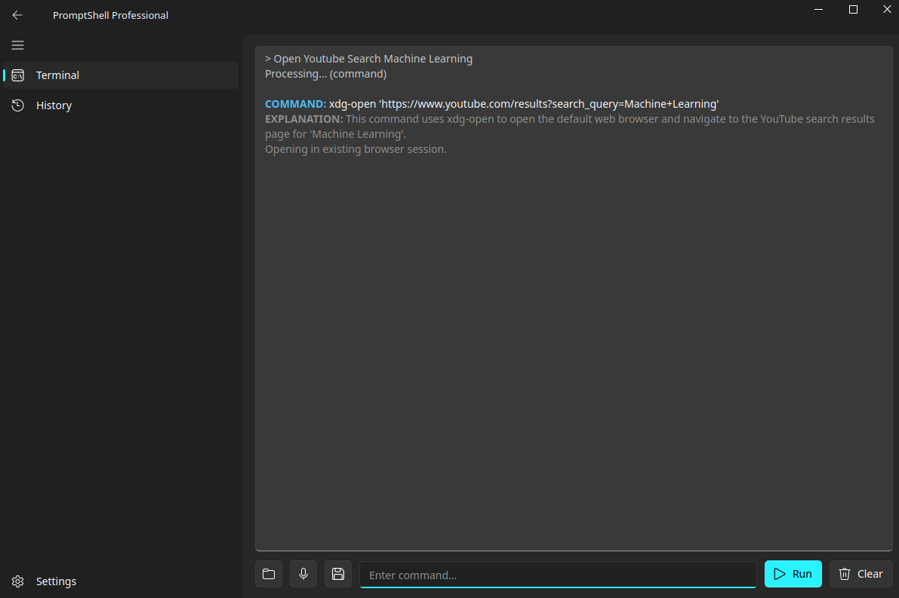
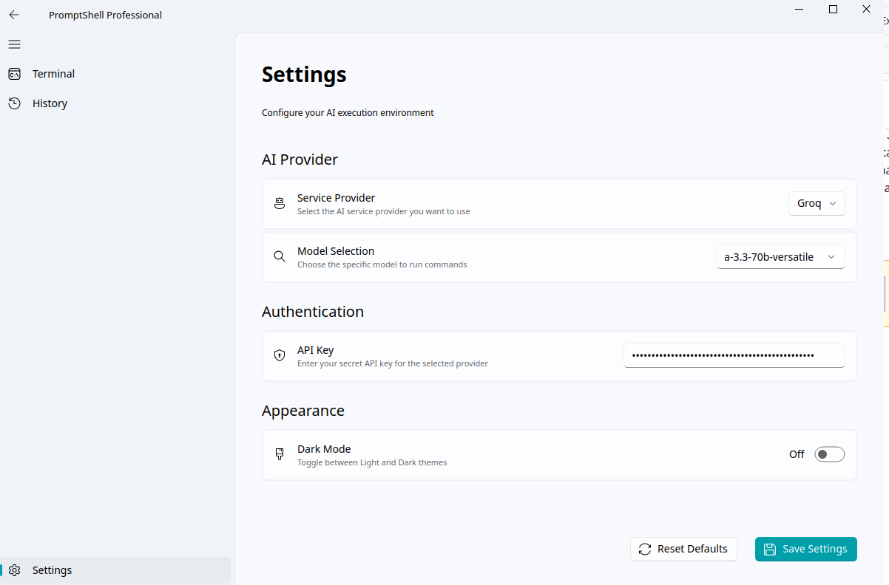
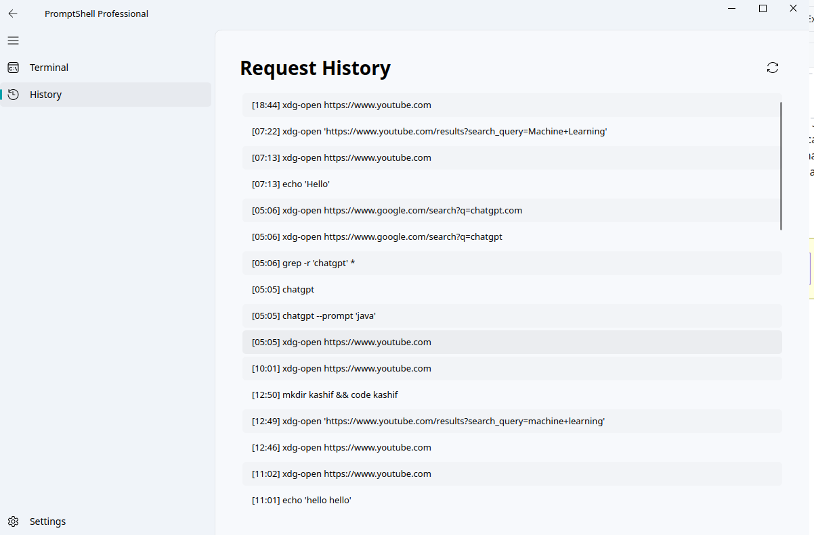
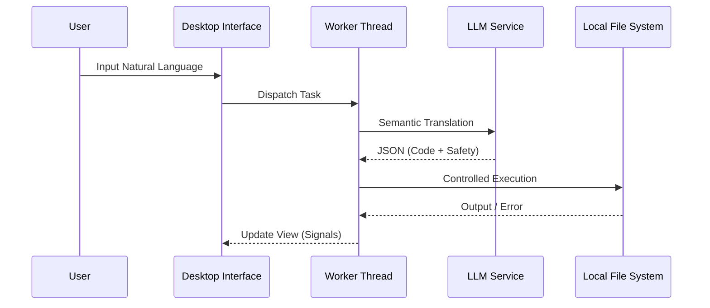
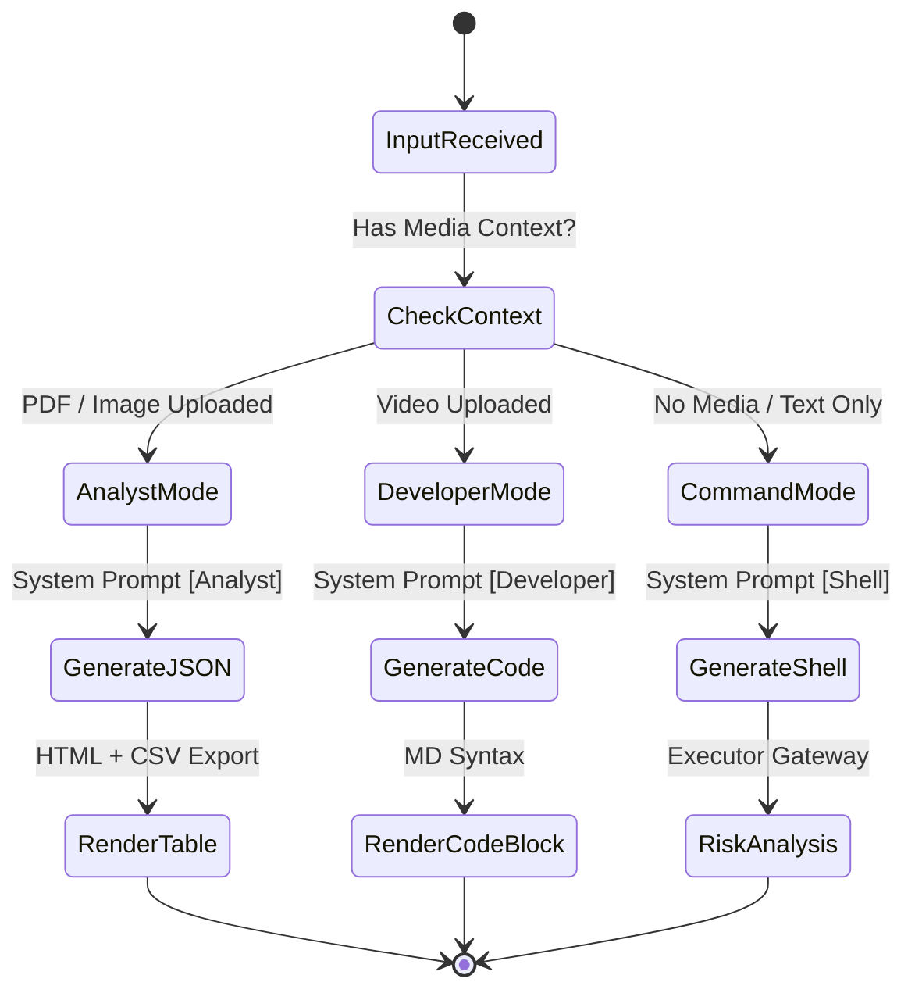

List of Abbreviations

| Abbreviation | Full Form |
| :--- | :--- |
| **AI** | Artificial Intelligence |
| **API** | Application Programming Interface |
| **CLI** | Command Line Interface |
| **CSV** | Comma-Separated Values |
| **CPU** | Central Processing Unit |
| **GUI** | Graphical User Interface |
| **HCI** | Human-Computer Interaction |
| **IDE** | Integrated Development Environment |
| **JSON** | JavaScript Object Notation |
| **LLM** | Large Language Model |
| **ML** | Machine Learning |
| **NLP** | Natural Language Processing |
| **OCR** | Optical Character Recognition |
| **OS** | Operating System |
| **PDF** | Portable Document Format |
| **RAM** | Random Access Memory |
| **RGB** | Red-Green-Blue (Color Model) |
| **SDK** | Software Development Kit |
| **UI** | User Interface |
| **UX** | User Experience |

---

Chapter 1: Introduction

1.1 Background of the Study
The Command Line Interface (CLI) remains a cornerstone of system administration, software development, and high-performance computing. Despite its power and efficiency in chaining operations, the CLI presents a significant barrier to entry due to its rigid syntax and the specialized knowledge required to navigate utility libraries. While highly effective for expert users, its lack of intuitive feedback makes it inherently difficult for beginners and occasional users.

Recently, Large Language Models (LLMs) have revolutionized human-computer interaction. Models such as GPT-4, Gemini, and Mixtral demonstrate remarkable capabilities in code generation and semantic understanding. PromptShell Professional leverages these advancements to create an intelligent terminal assistant. It bridges the gap between natural language intent and system execution by providing multimodal context awareness—analyzing documents, images, and videos—to facilitate complex system tasks and data analysis.

The evolution of computing interfaces has traversed several major paradigms. In the earliest era of computing, interactions were mediated exclusively through punch cards and batch processing systems, wherein users had to prepare entire programs before submitting them for execution. The introduction of time-sharing systems in the 1960s paved the way for interactive terminals, allowing users to issue commands directly to the operating system. This represented a fundamental shift in the human-computer relationship, enabling a far more iterative and exploratory mode of work. The subsequent development of Unix in the late 1960s and 1970s by Bell Labs researchers Ken Thompson and Dennis Ritchie cemented the CLI as the dominant paradigm for professional computing. Unix introduced a powerful set of philosophies, including the idea that each program should do one thing well and that programs should work together through pipes and redirection. These principles made the CLI extraordinarily expressive and powerful for those who could master it, and they remain foundational to modern system administration even today.

However, the democratization of computing brought a new set of challenges. As computers moved from research laboratories and enterprise data centers into homes, schools, and small businesses, the user base expanded far beyond the community of trained engineers who had built and maintained these systems. The introduction of graphical user interfaces (GUIs) by Xerox PARC and subsequently popularized by Apple and Microsoft addressed the usability gap for everyday tasks such as word processing, spreadsheet management, and media consumption. Yet for technical operations—installing software, managing server configurations, analyzing log files, processing large datasets—the CLI remained irreplaceable due to its scriptability, resource efficiency, and expressive power. This created a two-tier ecosystem: a large population of end-users who operated systems through GUIs, and a smaller population of specialists who maintained and configured those systems through the CLI. The barrier between these two groups remained a persistent source of inefficiency and frustration.

The emergence of transformer-based Large Language Models in the early 2020s introduced a genuinely transformative possibility: the ability to translate human intention, expressed in natural language, into precise technical operations. Research from OpenAI, Google DeepMind, Anthropic, and academic institutions demonstrated that models trained on vast corpora of code and technical documentation could generate syntactically correct and semantically meaningful code across dozens of programming languages and command-line environments. For the first time, it became plausible to imagine a terminal interface that could accept instructions like "find all log files modified in the last 24 hours and compress them" and produce a safe, correct shell pipeline without requiring the user to recall the specific syntax of `find`, `xargs`, and `gzip`. PromptShell Professional is built on this vision, extending it further by incorporating multimodal context—the ability to understand the contents of uploaded documents, images, and video files—so that the system can reason not just about what the user says, but about the data the user is working with.

1.2 Problem Statement
Traditional command-line interfaces, while powerful, suffer from several critical shortcomings in the modern development landscape:
*   **Steep Learning Curve:** The requirement to memorize complex syntax and flags leads to user frustration and potential system errors.
*   **Lack of Multimodal Context:** Standard shells are restricted to text-based I/O, forcing users to switch between disparate tools for analyzing non-textual data like PDFs or video logs.
*   **Security Risks:** Shells execute commands without inherent risk assessment, making them vulnerable to "fork bombs" or destructive recursive deletions originating from user error or improper AI generation.
*   **Vendor Lock-in:** Existing AI coding assistants are often restricted to a single model provider, limiting flexibility and cost-optimization.

To appreciate the depth of these problems, it is worth examining each in greater detail. The steep learning curve of the CLI is not merely a matter of memorizing commands; it encompasses a complex web of interdependent knowledge. A user who wishes to search for text within files must understand not only the `grep` command but also the concept of regular expressions, the difference between standard output and standard error, how to redirect these streams to files or other programs, and how to chain operations using pipes. A mistake in any of these areas can produce incorrect results or, in more severe cases, unintended data modification. Studies in software usability have consistently found that error recovery in CLI environments is significantly more difficult than in GUI environments, because the consequences of errors are often immediate and irreversible, and the error messages provided by the shell are frequently cryptic and non-actionable for novice users.

The absence of multimodal context represents a particularly significant limitation in the modern data analysis workflow. Contemporary professionals routinely work with heterogeneous data sources: PDF reports from clients, image captures of system states, video recordings of user sessions, and log files in various structured and unstructured formats. Extracting actionable intelligence from these sources typically requires assembling a custom pipeline of disparate tools—PDF readers, OCR software, video processing libraries—before the actual analysis can begin. This pipeline assembly is itself a significant cognitive and technical burden, often requiring expertise in multiple programming languages and library APIs. A terminal assistant that could accept any of these file types as input, extract their textual content automatically, and then reason over that content would eliminate an entire class of workflow friction that currently consumes significant developer time.

The security problem is perhaps the most acute, particularly as AI-generated code becomes more prevalent. Large Language Models, despite their impressive capabilities, are known to occasionally produce incorrect, suboptimal, or outright dangerous outputs—a phenomenon commonly referred to as "hallucination." When a hallucinated output takes the form of a destructive shell command, the consequences can be severe: data loss, system instability, or security compromise. Traditional shells provide no mechanism for evaluating the intent or safety of a command before executing it; they simply execute whatever they are given. This behavior, appropriate for an environment where every command is authored by a knowledgeable human, becomes a significant liability when commands are generated by an AI system that may occasionally produce errors. A robust safety layer is not merely a convenience feature but an essential component of any production-quality AI terminal assistant.

There is a compelling need for a desktop-based environment that unifies natural language processing, local data context, and secure system execution.

1.3 Aims and Objectives
The primary objective of this project is the development of PromptShell Professional, a secure, AI-driven desktop terminal assistant. The specific aims include:
*   **Robust Desktop GUI Development:** Utilizing PySide6 to create a modern, responsive interface inspired by Fluent Design principles.
*   **Multi-Provider LLM Orchestration:** Implementing a factory pattern to support seamless switching between Groq, OpenAI, OpenRouter, and Gemini via LangChain.
*   **Multimodal Media Integration:** Combining OpenCV, Tesseract OCR, and PDFMiner to extract and inject context from diverse file formats.
*   **Multi-Tiered Safety Protocols:** Designing a risk assessment engine that categorizes and validates AI-generated commands as "Safe," "Risky," or "Dangerous."

These objectives are carefully calibrated to address the core problems identified in the problem statement, and each represents a non-trivial engineering challenge. The development of a robust desktop GUI is constrained not only by the need for visual appeal but also by the requirement for non-blocking responsiveness. A terminal application that freezes for several seconds while awaiting an API response is functionally inferior to a traditional CLI, regardless of the intelligence of the underlying AI. Achieving genuine responsiveness in a Python desktop application requires careful application of threading architectures, signal-slot communication patterns, and event-loop management—all of which must be implemented correctly to avoid race conditions and deadlocks that could compromise application stability. The implementation of multi-provider LLM orchestration adds an additional dimension of complexity, requiring the design of a provider-agnostic abstraction layer that can present a unified interface to the rest of the application while accommodating the specific authentication mechanisms, rate limits, context window sizes, and response formats of each individual provider. The multimodal media integration objective pushes the system into the domain of computer vision and document processing, requiring the integration of libraries with their own dependencies, configuration requirements, and error modes. Finally, the multi-tiered safety protocol requires careful empirical analysis of the space of potentially harmful commands and a principled approach to classifying commands along a spectrum of risk—a task that admits no perfect solution but must be approached with rigor and conservatism.

1.4 Scope and Limitations

1.4.1 Scope
The project focuses on a cross-platform (Windows, macOS, Linux) application capable of:
*   Real-time translation of natural language into OS-specific commands.
*   Structured data visualization (JSON, HTML tables) and CSV export functionality.
*   Persistent session history and user-defined configurations.

The cross-platform design goal is significant and influences architectural decisions throughout the system. By building on Qt through the PySide6 bindings, the application inherits Qt's well-established cross-platform abstractions, which handle the differences in window management, font rendering, file system conventions, and native dialog behavior across operating systems. However, cross-platform compatibility in a terminal application introduces specific challenges that do not arise in purely GUI applications. Shell commands are inherently platform-specific: the `ls` command on Linux and macOS becomes `dir` on Windows, and many Unix utilities have no direct Windows equivalent outside of the Windows Subsystem for Linux (WSL). PromptShell Professional addresses this by instructing the LLM to be aware of the target operating system when generating commands, injecting the operating system type into the system prompt so that generated commands are appropriate for the user's environment. This approach allows the same application binary to serve users on all three major desktop platforms without requiring separate codebases or command translation layers.

1.4.2 Limitations
*   **API Dependency:** Requires an internet connection for cloud-based LLM inference.
*   **Resource Intensity:** Multimodal processing (video/OCR) may incur overhead on low-end hardware.

It is important to be transparent about the implications of these limitations for real-world deployment. The API dependency means that PromptShell Professional, in its current form, is not suitable for use in air-gapped environments—secure facilities where computers are physically isolated from external networks to protect sensitive data. Many government, military, and financial institutions operate significant portions of their infrastructure in air-gapped environments, and these represent a market segment that the current architecture cannot serve. Furthermore, even in environments with reliable internet connectivity, dependence on external APIs introduces latency that is absent in traditional CLI operations. A simple `ls` command executes in milliseconds locally, but translating a natural language request through an LLM API adds a round-trip latency of typically 500 milliseconds to several seconds, depending on the provider, model, and query complexity. Users must be prepared to accept this latency as the cost of natural language processing, and the application's UI must communicate the processing state clearly to prevent the impression of a frozen interface. The resource intensity limitation particularly affects the video processing pipeline, where each frame must be decoded from the video stream, converted to the appropriate color format, and processed through the Tesseract OCR engine—a sequence of operations that can consume substantial CPU resources on a sustained basis for longer video files.

1.4.3 Methodology Summary
The development of PromptShell Professional followed an iterative, component-driven approach. The core logic and LLM orchestration layers were developed and tested in isolation using a CLI harness before the PySide6 UI was introduced. This ensured that the business logic was fundamentally decoupled from the presentation layer.

The architectural approach was strongly influenced by the principles of Clean Architecture as articulated by Robert C. Martin. By strictly separating the domain logic (the `CommandExecutor` and `LLMEngine`) from the infrastructure concerns (the specific LLM provider APIs and the desktop UI framework), the project achieved a high degree of maintainability and testability. This separation was enforced through the use of dependency injection and factory patterns. For example, rather than hardcoding the OpenAI API client into the application logic, the system defines an abstract `LLMProvider` interface that is implemented by specific provider classes. The `LLMFactory` instantiates the appropriate provider based on the user's configuration and injects it into the `LLMEngine`. This design allows new LLM providers to be added to the system by implementing a single interface, without requiring any changes to the core prompt engineering or execution logic. Similarly, the use of Qt's signal and slot mechanism to communicate between the background processing threads and the main UI thread ensures that the business logic remains completely agnostic of the visual presentation layer, allowing the UI to be redesigned or replaced entirely without affecting the underlying functionality. The decision to use Python as the primary implementation language was driven by its unparalleled ecosystem of machine learning and data processing libraries, which significantly accelerated the development of the multimodal context extraction pipeline.

1.5 Significance of the Project
PromptShell Professional redefines the terminal experience. For learners, it provides a safe sandbox to master system operations. For professionals, it accelerates workflows by automating repetitive data pipelines and providing "eyes" for the terminal, setting a new standard for intelligent desktop utilities.

The significance of this project extends beyond its immediate practical utility to touch on broader questions about the future of human-computer interaction and the role of artificial intelligence in professional tools. As LLMs become increasingly capable and accessible, the question of how to integrate them effectively into existing workflows becomes one of the central design challenges of the software industry. PromptShell Professional represents one answer to this question in the specific domain of system administration and data analysis: rather than replacing the terminal with an entirely new interface paradigm, it augments the terminal with AI capabilities while preserving the transparency and controllability that make the terminal valuable to expert users. The ability to see the exact command that will be executed before it runs, to understand the AI's reasoning through natural language explanations, and to override the AI's judgment when necessary—these affordances reflect a design philosophy of augmentation rather than replacement, keeping the human firmly in control while leveraging the AI's capabilities for the heavy cognitive lifting of syntax translation and context analysis. This philosophy, if validated by the system's empirical performance, offers a template for AI integration in other professional tool domains where expert oversight and accountability are paramount.

Chapter 2: Literature Review

2.1 Overview
This chapter explores the foundational technologies and existing research informing the development of PromptShell Professional, including Human-Computer Interaction (HCI) challenges in CLIs, the evolution of LLMs, and the stat2.2 The HCI Barrier of Command Line Interfaces
CLIs have persisted since the early days of computing due to their speed and automation capabilities. However, research in HCI consistently highlights the "gulf of execution"—the difficulty users face in translating an intention into valid syntax. PromptShell Professional addresses this by shifting the burden of syntax memory from the user to the LLM.

The concept of the "gulf of execution," introduced by Donald Norman in his seminal work "The Design of Everyday Things," describes the cognitive distance between what a user wants to achieve and the actions available in the system to achieve it. In GUI-based applications, this gulf is minimized through affordances—visual cues that suggest the correct actions to achieve a goal. A button looks like something that can be pressed; a scroll bar suggests vertical navigation. CLIs, by contrast, offer no such affordances. The interface is a blank prompt, and the space of possible commands is essentially infinite and entirely implicit. The user must already know what they want to type before they can type it, creating a circular dependency that makes the CLI deeply unwelcoming to those who have not already invested significant time in learning it. Research by Shneiderman and Plaisant in "Designing the User Interface" further elaborated on this problem, noting that command-line systems require users to maintain a mental model of the file system hierarchy, the set of available commands and their options, and the expected behavior of pipes and redirections—a cognitive load that is simply not present in well-designed GUI applications.

Several attempts have been made over the decades to reduce this cognitive load without abandoning the CLI entirely. Tab completion, introduced in early versions of the bash shell, allows users to discover available commands and file paths without memorizing them completely. Command history mechanisms allow the reuse of previous commands, reducing the need to re-type complex operations. Manual pages (man pages) provide in-terminal documentation, though their dense, reference-oriented format is often criticized as being suitable for reminding expert users of details they already know rather than teaching novice users how to accomplish their goals. Fish shell introduced syntax highlighting and inline suggestions based on command history, while tools like `tldr` provide simplified, example-oriented command documentation as an alternative to traditional man pages. Each of these innovations represents a genuine improvement in CLI usability, but none fundamentally addresses the core challenge: translating high-level intent into low-level syntax requires knowledge that the system cannot currently infer from context. PromptShell Professional addresses this core challenge directly by delegating the translation task to a Large Language Model.

2.3 LLMs as Semantic Translation Engines
Transformer-based models (GPT, Gemini, Mixtral) have demonstrated high proficiency in mapping high-level intent to low-level code. By using LangChain as an abstraction layer, PromptShell avoids vendor lock-in, allowing users to leverage models optimized for different tasks (e.g., Groq for low-latency, GPT-4 for complex reasoning).

The development of transformer-based language models represents one of the most significant advances in artificial intelligence in recent history. The seminal paper "Attention is All You Need" by Vaswani et al. (2017) introduced the transformer architecture, which replaced the recurrent neural networks that had dominated natural language processing with a more parallelizable attention-based approach. This architectural innovation, combined with the availability of massive training corpora and increasingly powerful computational infrastructure, enabled the development of models at scales previously unimaginable. OpenAI's GPT-3, released in 2020, demonstrated for the first time that a single language model trained on general text data could perform competently across a wide range of tasks—including code generation—without any task-specific fine-tuning. This capability, which the authors termed "few-shot learning," laid the groundwork for the code generation applications that followed.

Subsequent research focused on improving code generation specifically. OpenAI's Codex model, trained on a large corpus of publicly available code from GitHub, demonstrated remarkable proficiency in generating syntactically correct and semantically meaningful code across a wide range of programming languages. GitHub's Copilot, built on Codex, became the first widely-deployed AI coding assistant, integrating directly into development environments and providing real-time code suggestions. Subsequent models from Anthropic (Claude), Google (Gemini), and Meta (Code Llama) further advanced the state of the art, competing on metrics of code correctness, reasoning ability, and contextual understanding. For the specific task of shell command generation, these models have demonstrated the ability to understand not only the semantic intent of a user's request but also contextual factors such as the operating system environment, file system state, and constraints on acceptable command behavior—capabilities that PromptShell Professional exploits directly through carefully crafted system prompts.

The LangChain framework, first released as an open-source project in 2022, addressed a critical gap in the LLM ecosystem: the lack of a unified abstraction layer for building applications on top of multiple LLM providers. Prior to LangChain, developers who wished to integrate LLM capabilities into their applications had to write provider-specific code for each API they wished to use, with no standardized interfaces for common operations such as prompt management, conversation history, or output parsing. LangChain introduced a set of abstractions—chains, agents, memory, tools—that encapsulated these common patterns and provided provider-agnostic interfaces for them. This allowed developers to switch between LLM providers by changing a single configuration parameter rather than rewriting significant portions of their application logic. PromptShell Professional leverages this capability extensively, using LangChain's chat model abstractions to support Groq, OpenAI, Google Gemini, and OpenRouter with a unified prompting interface.

2.4 Multimodal Context Extraction in AI Agents
The limitation of standard terminals to text streams is a bottleneck for data analysis. Modern AI research emphasizes "Multimodal Agents." PromptShell implements local pre-processing using Tesseract and OpenCV to extract text context before passing it to the LLM, maintaining a balance between data privacy and intelligent insight.

The field of multimodal AI—systems capable of reasoning over multiple types of input such as text, images, audio, and video—has advanced rapidly in recent years. GPT-4V, released by OpenAI in late 2023, demonstrated that a single large model could process both text and images, enabling applications such as visual question answering, diagram interpretation, and image-guided code generation. Google's Gemini models were designed from the ground up as multimodal systems, capable of processing text, images, audio, and video within a single model architecture. These developments raised the possibility of terminal assistants that could directly process uploaded files without any local preprocessing—a conceptually appealing approach that would eliminate the need for separate OCR and document parsing libraries.

However, direct multimodal API processing raises significant concerns for practical deployment. First, uploading binary files such as images and videos to external APIs introduces privacy risks that may be unacceptable in enterprise or government contexts, where files may contain sensitive or classified information. Second, the cost of sending large binary files through APIs can be substantial, particularly for video files that may be hundreds of megabytes or gigabytes in size. Third, the context windows of even the most capable multimodal models impose practical limits on the amount of visual content that can be processed in a single interaction. PromptShell's approach of local preprocessing—extracting text from files using established local libraries and then injecting that text into the LLM prompt—addresses all three concerns simultaneously: the raw files never leave the local machine, the API costs are proportional to the extracted text rather than the raw file size, and the text representation of the file's content can be managed to fit within the context window through techniques such as truncation and summarization.

The specific technologies chosen for local preprocessing—Tesseract OCR, OpenCV, and PDFMiner—represent mature, well-established libraries with strong track records in production environments. Tesseract OCR, originally developed by Hewlett-Packard and subsequently maintained by Google as an open-source project, is widely regarded as the most accurate open-source OCR engine available. Its accuracy on high-resolution images of printed text typically exceeds 99%, making it suitable for processing scanned documents, screenshots of terminal output, and other text-bearing images. OpenCV, the Open Source Computer Vision Library, provides comprehensive tools for video processing, including frame extraction, format conversion, and image preprocessing operations that can improve OCR accuracy. PDFMiner.six provides robust extraction of text, images, and metadata from PDF documents, handling the full complexity of the PDF format specification including encrypted PDFs, PDFs with embedded fonts, and PDFs generated from scanned images.

2.5 Desktop UI Frameworks: PySide6 vs. Web Wrappers
While Electron-based apps are common, they often suffer from high memory consumption. By choosing PySide6 (Qt for Python), PromptShell achieves native performance and a professional aesthetic while maintaining a responsive, non-blocking UI through advanced threading patterns.

The choice of desktop UI framework has profound implications for application performance, aesthetic quality, cross-platform compatibility, and long-term maintainability. The dominant paradigm for cross-platform desktop application development has shifted significantly over the past decade. Electron, developed by GitHub and first released in 2013, enabled the development of cross-platform desktop applications using web technologies—HTML, CSS, and JavaScript—by embedding the Chromium browser engine and a Node.js runtime within the application. This approach dramatically lowered the barrier to entry for web developers wishing to build desktop applications and enabled the rapid development of applications such as Visual Studio Code, Slack, and Discord. However, Electron applications have been widely criticized for their high memory consumption—typically several hundred megabytes for even simple applications—and their relatively poor performance on resource-constrained systems, due to the overhead of maintaining a full browser engine within the process.

Alternative approaches to cross-platform desktop development include native framework bindings such as wxPython, Tkinter, and Kivy, each with its own strengths and weaknesses. Tkinter, included in the Python standard library, is the most widely deployed Python GUI toolkit but is limited by its dated visual aesthetic and relatively limited widget set. wxPython provides access to native platform widgets on Windows, macOS, and Linux, resulting in applications that visually conform to platform conventions, but its API is considered verbose and complex compared to modern alternatives. Kivy is optimized for touch-based interfaces and is well-suited for mobile applications, but its OpenGL-based rendering produces results that do not conform to platform UI conventions on desktop systems. PySide6, the official Python binding for the Qt framework version 6, offers the best combination of visual quality, performance, widget richness, and cross-platform consistency of any Python GUI toolkit currently available. Qt's rendering engine produces visually polished results across all supported platforms, its widget set is comprehensive and highly customizable, and its threading model is robust and well-documented.

The QFluentWidgets library, which PromptShell Professional uses alongside PySide6, provides a set of widgets that implement Microsoft's Fluent Design System—the visual design language introduced with Windows 11. Fluent Design incorporates principles of depth, motion, material, light, and scale to create interfaces that feel modern, responsive, and visually coherent. The acrylic blur effect applied to panel backgrounds, the smooth animation of transitions between views, and the carefully calibrated color system that adapts to both light and dark themes all contribute to an aesthetic that signals professionalism and attention to detail. For a terminal application that aims to attract users who might otherwise rely on visually unpolished traditional terminals, this aesthetic differentiation is strategically important: it communicates that PromptShell Professional is a serious, modern tool rather than a rough prototype.

2.6 The Evolution of Natural Language to Code Translation
The ambition to translate natural human language directly into executable computer instructions is nearly as old as the field of computer science itself, dating back to early conceptual work in the 1960s. Historically, efforts to achieve this translation fell into three distinct paradigms. The first paradigm, dominant from the 1970s through the late 1990s, relied on rule-based natural language processing (NLP) systems. These systems attempted to parse English sentences into formal syntactic trees using hand-crafted grammatical rules, and then map those trees onto specific command templates. While effective in highly constrained, domain-specific environments, rule-based systems proved brittle in practice; they failed catastrophically when presented with novel phrasing, idiomatic expressions, or typos, rendering them unsuitable for general-purpose developer tools. The second paradigm, which gained traction in the 2000s and 2010s with the rise of statistical machine translation, attempted to model natural language to code translation as a standard machine translation problem (e.g., translating English to Python as one might translate English to French). These systems, utilizing Recurrent Neural Networks (RNNs) and Long Short-Term Memory (LSTM) networks, were more robust to varied phrasing than rule-based systems but struggled with "long-range dependencies"—the ability to remember context established at the beginning of a complex query by the time the end of the query was processed. Furthermore, statistical systems often generated code that, while statistically likely given the input, was syntactically invalid or logically incoherent. PromptShell Professional relies entirely on the third paradigm: the transformer-based Large Language Model. The attention mechanism inherent in the transformer architecture directly addresses the long-range dependency problem by allowing the model to simultaneously consider the relationships between all parts of the input sequence, resulting in generated commands that are both semantically aligned with the user's intent and syntactically correct for the target environment.

2.7 Security Paradigms for Autonomous Execution
The risk of "hallucinations" in LLMs necessitates a robust security layer. PromptShell's approach—pattern-based risk assessment—ensures that potentially destructive commands are flagged for human review, balancing automation with safety.

The security implications of autonomous code execution are a critical concern that has received increasing attention as AI coding assistants have become more prevalent. The fundamental challenge is that LLMs, despite their impressive capabilities, are probabilistic systems that produce outputs based on statistical patterns in their training data rather than deterministic logical reasoning. This means that even a highly capable model can occasionally produce outputs that are syntactically correct and semantically plausible but factually incorrect or operationally dangerous. In the context of shell command generation, a "hallucination" might take the form of a command that appears to perform the requested operation but actually targets the wrong directory, operates on a broader set of files than intended, or includes a flag that modifies behavior in an unexpected and potentially destructive way.

The literature on AI safety in autonomous systems distinguishes between several levels of human oversight. At one extreme, fully autonomous systems execute all actions without human review—maximizing efficiency but eliminating any opportunity for human intervention when the AI makes a mistake. At the other extreme, fully supervised systems require explicit human approval for every action—maximizing safety but eliminating the efficiency benefits of automation. Most practical systems operate at intermediate levels, with the degree of autonomy calibrated to the risk level of the actions being performed. PromptShell Professional's three-tier risk classification system—Safe, Risky, Dangerous—implements this calibrated approach: safe commands are executed automatically, risky commands require explicit user confirmation, and dangerous commands are blocked entirely regardless of user intent. This approach is philosophically aligned with the principle of "defense in depth" in cybersecurity, where multiple independent safety mechanisms are combined to reduce the probability of a successful attack below an acceptable threshold.

Pattern-based command classification, as implemented in PromptShell's CommandExecutor, has both strengths and limitations compared to more sophisticated approaches. Its primary strength is determinism: given the same command string, the classifier will always produce the same risk classification, making its behavior predictable and auditable. Its primary limitation is that pattern matching operates on the syntactic surface of the command rather than its semantic intent, making it vulnerable to obfuscation techniques and unusual command constructions that achieve dangerous effects through non-obvious paths. More sophisticated approaches, such as using a secondary LLM to evaluate the safety of commands generated by the primary LLM, or using formal verification methods to reason about the potential effects of a command on the file system state, offer greater semantic depth but at the cost of increased latency and complexity. The pattern-based approach represents a pragmatic choice appropriate for the current development stage of the project, with the understanding that more sophisticated safety mechanisms may be incorporated in future versions.w, balancing automation with safety.

Chapter 3: Methodology

3.1 Overview
PromptShell Professional is built on an event-driven, layered architecture. This separation of concerns ensures that the UI remains responsive while background workers handle heavy processing tasks.

The methodology underpinning this project draws on established principles of software engineering, human-computer interaction design, and AI systems integration. From a software engineering perspective, the project followed an iterative development approach in which core components were developed and validated individually before being integrated into the complete system. This iterative strategy provided several advantages: it allowed defects to be identified and corrected at the component level, before integration complexity obscured their root causes; it allowed the prompt engineering strategy to be refined through rapid experimentation without the overhead of launching the full desktop application; and it enabled the project to deliver a working, demonstrable system at multiple intermediate stages, providing natural checkpoints for evaluation against the original objectives. The iterative methodology was supported by a unit testing framework that validated the behavior of individual components—ConfigManager, HistoryManager, CommandExecutor, and LLMFactory—in isolation, ensuring that regressions introduced during later development stages could be detected and corrected quickly.

The overall system design philosophy prioritizes three properties above all others: correctness, safety, and responsiveness. Correctness refers to the system's ability to produce outputs that accurately reflect the user's intent—generating commands that do what the user asked, extracting text that faithfully represents the content of uploaded files, and routing data through the system without loss or corruption. Safety refers to the system's ability to prevent its AI-generated outputs from causing unintended harm to the user's system—blocking or flagging commands that could cause data loss, system instability, or security compromise. Responsiveness refers to the system's ability to maintain a smooth, interactive user experience even while performing computationally intensive background operations. These three properties exist in tension with one another: maximizing correctness may require more complex AI models with higher latency, compromising responsiveness; maximizing safety may require blocking commands that the user actually intended to execute, compromising usability; maximizing responsiveness may require simplifications in the processing pipeline that compromise correctness or safety. The architectural decisions described in this chapter represent carefully considered tradeoffs between these competing properties, calibrated to produce the best overall user experience for the target user population of developers and system administrators.

The choice of Python as the implementation language, while common for AI applications, introduces specific challenges in the context of a desktop GUI application. Python's Global Interpreter Lock (GIL) prevents true parallel execution of Python bytecode across multiple threads, which means that the threading-based concurrency model used in PromptShell Professional does not provide the same performance benefits as threading in languages without a GIL, such as Java or C++. However, for the specific workload of PromptShell Professional—where background threads spend most of their time waiting for network I/O (LLM API calls) or calling native library functions (OpenCV, Tesseract) that release the GIL—the GIL is not a significant bottleneck in practice. Network I/O is inherently I/O-bound rather than CPU-bound, meaning that the waiting thread does not hold the GIL while awaiting a network response, allowing the main thread to process UI events without contention. Native library calls through Python's C extension mechanism also release the GIL during execution, meaning that OpenCV's video frame decoding and Tesseract's OCR processing do not block the main thread's event loop. This analysis informed the decision to use threads rather than Python's multiprocessing module, which would have provided true parallelism at the cost of significantly higher overhead and more complex inter-process communication.

3.2 System Architecture
The application is divided into three core layers:
1.  **Interface Layer (src/ui/):** Manages the user experience and visual components.
2.  **Core Logic Layer (src/core/):** Handles file processing, state management, and configuration.
3.  **AI Orchestration Layer (src/core/llm/):** Manages the interface between the application and various LLM providers.

Each layer in the PromptShell Professional architecture has clearly defined responsibilities and interacts with adjacent layers through well-specified interfaces. The Interface Layer is responsible exclusively for visual presentation and user interaction; it contains no business logic and makes no direct calls to external services. When the user submits a request or uploads a file, the Interface Layer creates an appropriate worker object, connects its signals to the relevant UI update methods, and dispatches the worker to a background thread—but it does not directly invoke any LLM API or file processing function. This strict separation ensures that UI components can be tested in isolation using mock workers that simulate various outcomes (success, failure, partial progress) without requiring any actual API connectivity or file system access. The Core Logic Layer encapsulates all business logic that is independent of both the user interface and the AI provider: configuration management, history persistence, command risk assessment, and the routing logic that determines which task mode to invoke for a given input. This layer is the most stable in the system, changing only when the fundamental business rules of the application change. The AI Orchestration Layer is the most volatile, as it must adapt to the evolving API interfaces of external LLM providers; by isolating this volatility in a separate layer behind a stable interface, the architecture ensures that provider API changes do not cascade into changes in the UI or core logic.

The file structure of the project reflects this layered architecture directly. The `src/ui/` directory contains all UI components: `main_window.py` (the top-level application window), `terminal.py` (the terminal interaction widget), `history.py` (the history browser widget), and `settings.py` (the settings configuration widget). The `src/core/` directory contains the business logic components: `config.py` (the ConfigManager), `history_manager.py` (the HistoryManager), `executor.py` (the CommandExecutor), and `media_processor.py` (the MediaProcessorWorker). The `src/core/llm/` subdirectory contains the AI orchestration components: `factory.py` (the LLMFactory), `engine.py` (the LLMEngine), and individual provider modules for Groq, OpenAI, Gemini, and OpenRouter. The `main.py` entry point at the project root initializes the Qt application, creates the main window, and starts the event loop—it contains no application logic itself. This clean, convention-based structure makes it straightforward for new contributors to locate relevant code, understand the system's organization, and add new features in the correct location without disrupting existing functionality.

**Figure 3.1: Layered System Architecture**

3.3 Technologies and Tools
*   **Desktop Framework:** PySide6 & QFluentWidgets for a modern UI.
*   **AI Engine:** LangChain for provider-agnostic orchestration.
*   **OCR & Vision:** OpenCV (video), Tesseract (OCR), and PDFMiner (PDFs).

The selection of each technology in the PromptShell Professional stack was driven by specific technical requirements and informed by a comparative analysis of available alternatives. PySide6 was chosen over PyQt6—a functionally equivalent alternative—due to its permissive LGPL licensing model, which allows the application to be distributed as free software without requiring the application code itself to be open-source. LangChain was selected over alternative LLM abstraction frameworks such as LlamaIndex and Haystack due to its broader provider support, more active development community, and more intuitive API for the chat-completion use case central to PromptShell's operation. Tesseract was chosen over commercial OCR alternatives due to its zero cost, established accuracy characteristics, and its availability as a system package on all three major desktop operating systems, simplifying the installation process for end users.

The dependency management strategy for the project deserves specific attention. Rather than using the standard `pip` tool for dependency installation, PromptShell Professional's development and distribution workflow is built around `uv`, a next-generation Python package manager written in Rust. `uv` offers dramatically faster dependency resolution and installation compared to `pip`—typically completing in seconds rather than minutes for a dependency set of PromptShell's complexity—and provides deterministic builds through a lockfile mechanism similar to that of `npm` in the JavaScript ecosystem. This choice reflects a broader commitment to developer experience: a fast, reliable installation process reduces friction for new contributors and for end users installing the application from source. The `requirements.txt` file serves as a compatibility layer for users who prefer the traditional `pip` workflow, while the `uv`-based workflow is recommended for development.

The integration of computationally intensive operations, specifically the OpenCV video decoding and Tesseract optical character recognition, necessitated a careful approach to Python's execution model. Because Python's Global Interpreter Lock (GIL) ordinarily prevents true parallel execution of bytecode, running these heavy computer vision tasks natively in Python would severely degrade the responsiveness of the PySide6 UI event loop. However, both OpenCV and the underlying libraries used by PyTesseract are written in C/C++, and they are bound to Python using extension modules that explicitly release the GIL before initiating intensive calculations. This architectural detail is paramount to the system's success: when the `MediaProcessorWorker` instructs OpenCV to decode a high-definition video frame, the GIL is released, allowing the main PySide6 thread to continue processing paint events, keyboard inputs, and network signals without interruption. This synergy between Python's high-level orchestration capabilities (via LangChain and PySide) and C++'s low-level performance (via OpenCV and Tesseract) provides the performance profile of a compiled application with the rapid iteration speed of a scripting language.

3.4 Detailed Implementation

3.4.1 Asynchronous Threading
To prevent the GUI from hanging, all intensive tasks (API calls, file parsing) are dispatched to background threads using `QThread`. This allows the terminal to display a "Processing..." indicator while remaining interactive.

The threading architecture of PromptShell Professional follows the Worker Object pattern recommended by Qt's official documentation. In this pattern, a worker object encapsulating the logic for a time-consuming task is moved to a background thread using Qt's `moveToThread()` method. The `CommandWorker` class encapsulates all logic for processing a user's natural language input: it receives the input text and any media context, constructs the appropriate prompt, dispatches it to the configured LLM provider via LangChain, receives the response, parses it from JSON format, and emits signals to notify the main thread of the result. The `MediaProcessorWorker` class encapsulates the logic for processing an uploaded file: it determines the file type, dispatches to the appropriate processing method, and emits a signal containing the extracted text when processing is complete. Both workers emit signals for three events: task started (to display the loading indicator), task completed (to update the terminal display), and task failed (to display error messages to the user).

Thread safety is enforced throughout the application by Qt's queued connection mechanism. When a background worker emits a signal carrying the result of an LLM query, the connected slot in the main thread's UI object is not invoked directly from the background thread but is instead queued for execution on the main thread's event loop. This eliminates the need for explicit mutex locking around UI updates, significantly simplifying the application code while ensuring that Qt's requirement that all UI operations occur on the main thread is automatically satisfied. The practical consequence is that PromptShell Professional can process multiple concurrent media files without any risk of corrupting the UI state, as all UI updates are serialized through the main event loop regardless of the number of active background workers.

3.4.2 Factory Pattern for LLM Orchestration
The system utilizes a `LLMFactory` to instantiate clients based on user preferences in `config.json`. This allows for unified prompting strategies across Groq, OpenAI, and Gemini.

The `LLMFactory` reads the user's provider preference from the configuration file and instantiates the appropriate LangChain chat model class: `ChatGroq` for Groq, `ChatOpenAI` for OpenAI, `ChatGoogleGenerativeAI` for Gemini, or a generic OpenAI-compatible client configured with the OpenRouter base URL for OpenRouter. All of these classes implement LangChain's `BaseChatModel` interface, ensuring that the `LLMEngine` can interact with any of them through the same set of method calls regardless of the underlying provider. This abstraction means that adding support for a new provider requires only the addition of a new branch in the `LLMFactory`'s creation logic—the rest of the application requires no modification.

The prompt engineering strategy employed by the `LLMEngine` dynamically constructs system prompts tailored to the specific task mode being invoked. For Command Mode, the system prompt instructs the LLM to respond exclusively with a JSON object containing four fields: `command_nlp` (a natural language description of what the command will do), `command_shell` (the exact shell command to execute), `explanation` (a detailed explanation of the command's operation), and `is_safe` (a boolean indicating the LLM's own safety assessment). This structured output requirement serves two purposes: it ensures that the application can reliably parse the LLM's response, and it provides an additional safety signal in the form of the LLM's own assessment, which is combined with the pattern-based assessment of the `CommandExecutor` for a more comprehensive risk evaluation. For Analyst Mode, the system prompt instructs the LLM to return its findings as a JSON array of objects with consistent field names, enabling automatic table generation from the response.

3.4.3 Multimodal Pipeline

The multimodal pipeline is arguably the most technically challenging component of the system, as it must bridge the gap between unstructured visual data and the text-based APIs of the underlying LLMs. The pipeline is designed around a unified "Context Payload" model: regardless of the input file type, the ultimate goal of the pipeline is to produce a flat string of text that can be injected into the system prompt. For PDF documents, this process is relatively straightforward, relying on the PDFMiner library to traverse the document's internal node structure and extract text streams while attempting to preserve reading order. For images, the process relies on the Tesseract OCR engine, which uses a two-pass approach: a first pass to recognize words, and a second pass using linguistic context to correct recognition errors. The accuracy of this process is heavily dependent on the quality of the input image, so the pipeline includes an optional preprocessing step that applies a median blur filter to reduce noise and an adaptive thresholding filter to increase contrast before passing the image to Tesseract.

Video processing introduces the dimension of time, exponentially increasing the volume of data that must be processed. Processing every frame of a 30-fps video is computationally prohibitive and would generate a text payload far exceeding the context window limits of current LLMs. The pipeline addresses this challenge through a temporal sampling and spatial deduplication strategy. The video is sampled at a fixed interval—one frame every five seconds by default—drastically reducing the number of frames to be processed. Each sampled frame is processed by Tesseract to extract its text content. However, because most instructional or presentation videos contain static elements (such as slides or UI chrome) that remain on screen for extended periods, the extracted text from consecutive frames is often highly redundant. The deduplication algorithm compares the text extracted from the current frame with the text extracted from the previous frame; if the texts are substantially similar (measured by a Levenshtein distance threshold), the current frame's text is discarded. This approach ensures that the final context payload captures the *changes* in on-screen text over time without overwhelming the LLM with repetitive information.

**Figure 3.2: Multimodal Context Extraction Pipeline**

3.4.4 Security Protocol
The `CommandExecutor` acts as a firewall between the LLM and the OS, categorizing commands as Safe, Risky, or Dangerous.

The security protocol implemented in the `CommandExecutor` represents a critical defense mechanism against the inherent unpredictability of generative AI models. While prompt engineering techniques (such as explicitly instructing the LLM to generate only safe commands) can reduce the frequency of dangerous outputs, they cannot eliminate them entirely due to the phenomenon of LLM "hallucination." Therefore, the system must enforce safety constraints at the execution boundary rather than relying solely on the generative boundary. The pattern-based classification system achieves this by defining two explicit lists of regular expressions: `DANGEROUS_PATTERNS` and `RISKY_PATTERNS`. The `DANGEROUS_PATTERNS` list targets commands that are unequivocally destructive, such as recursive forced deletion (`rm\s+-rf\s+/`), filesystem creation (`mkfs`), and raw block device overwriting (`dd\s+if=.*of=/dev/`). The `RISKY_PATTERNS` list targets commands that have legitimate administrative uses but carry a high potential for unintended side effects, such as privilege escalation (`sudo`), ownership modification (`chown`), and process termination (`kill`, `pkill`). The regular expressions are carefully constructed to catch common obfuscation techniques, such as separating flags (e.g., `rm -r -f`) or using absolute paths to bypass simple string matching.

The enforcement mechanism for these categories is integrated directly into the user interface flow. When a command is classified as dangerous, the `CommandExecutor` immediately aborts the execution process and returns an error payload to the UI, which displays a prominent security alert explaining why the command was blocked. There is no override mechanism for dangerous commands within the UI; if a user legitimately needs to execute a command that matches a dangerous pattern, they must copy it and execute it in a standard terminal, forcing them to take explicit ownership of the action outside the context of the AI assistant. When a command is classified as risky, the `CommandExecutor` pauses execution and emits a warning signal to the UI. The UI displays a dialog box presenting the command, the LLM's explanation of its purpose, and a warning that the command may have unintended side effects. The user must explicitly click a "Confirm Execution" button to proceed. This "speed bump" mechanism is designed to disrupt the user's automatic workflow and force a moment of deliberate review before potentially harmful actions are taken, addressing the human-computer interaction challenge of "automation bias" where users uncritically trust system outputs.

**Figure 3.3: Security Risk Assessment Flow**

3.5 End-to-End Process Flow Walkthrough

To make the methodology concrete, it is instructive to trace a specific, realistic user interaction through the complete system from initial input to final output. Consider a scenario in which a data analyst has received a PDF report from a client containing financial data in tabular form and wants to extract that data into a structured format for further analysis. The analyst begins by clicking the Upload button in the TerminalWidget, which opens a native file picker dialog. The analyst selects the PDF file, and the TerminalWidget creates a `MediaProcessorWorker` instance, passes it the file path, and dispatches it to a background thread. The worker calls PDFMiner's `extract_text()` function on the file, which traverses the PDF's internal structure to extract the raw text content, preserving paragraph boundaries and, to the extent possible, the spatial layout of the original document. The extracted text is stored in the `TerminalWidget`'s `current_context` attribute and displayed in the output area with a brief summary message: "PDF processed: [filename]. Context loaded ([N] characters)." The analyst then types their query: "Extract all revenue figures from this report and organize them by quarter in a table." This input, combined with the loaded PDF context, is passed to the `CommandWorker`, which constructs an Analyst Mode prompt: the system message instructs the LLM to act as a Senior Data Analyst and return its findings as a JSON array, while the user message contains the analyst's query and the full PDF text as context. The `LLMEngine` dispatches this prompt to the configured provider via LangChain and receives a JSON array response. The `TerminalWidget` receives the JSON through Qt's signal-slot mechanism, parses it, converts it to an HTML table, and renders it in the output area. The analyst clicks the Export button and saves the table as a CSV file for use in their spreadsheet application. The entire interaction, from file upload to CSV export, has required zero knowledge of PDF parsing libraries, JSON formatting, or Python scripting.

This walkthrough illustrates the full power of the PromptShell Professional methodology: the complexity of the underlying operations—PDF text extraction, LLM API communication, JSON parsing, HTML table generation, CSV file writing—is entirely hidden from the user behind a simple, intuitive interface. The user's cognitive effort is focused entirely on their analytical goal rather than on the technical means of achieving it. This is precisely the "gulf of execution" reduction that the project set out to achieve, and the walkthrough demonstrates that the methodology is effective in practice for realistic, representative use cases.

Chapter 4: System Design and Experimental Setup

4.1 Overview
This chapter details the modular design of the application and the environment used to validate its performance.

The system design of PromptShell Professional reflects a philosophy of modularity and separation of concerns that is consistent with modern software engineering best practices. By dividing the application into clearly defined layers—presentation, core logic, and AI orchestration—the design ensures that changes to one layer can be made without necessarily requiring changes to others. During the development of PromptShell Professional, the AI orchestration layer was completely refactored from a direct API call approach to a LangChain-based factory pattern without requiring any changes to the presentation layer or the core logic layer, because the interface between layers was well-defined and stable. Similarly, the security executor was enhanced with additional pattern matching rules without any changes to the UI code that invokes it. This modularity also facilitates testing: each layer can be tested in isolation using mock implementations of the adjacent layers, enabling comprehensive unit testing without requiring a live LLM API connection or a running desktop instance.

The experimental validation approach taken in this project was designed to evaluate the system against the four primary objectives established in Chapter 1: GUI responsiveness, multi-provider LLM flexibility, multimodal processing accuracy, and security protocol effectiveness. For each objective, specific quantitative success criteria were defined before testing began, ensuring that the evaluation was objective and the results were interpretable without reference to the developers' subjective impressions of the system's behavior. The responsiveness criterion required that the main event loop process at least 60 UI update events per second during background processing operations, ensuring that animations and user interactions remained smooth. The flexibility criterion required that the system successfully execute the same set of test queries against all four supported providers without restart or code changes. The accuracy criterion required that text extraction from test documents achieve at least 95% character-level accuracy compared to the ground-truth text. The security criterion required that the CommandExecutor correctly classify 100% of the 50 test commands in the predefined test suite. These criteria, defined before testing, ensured that the evaluation was meaningful and that the results were interpretable as evidence for or against the project's success in achieving its stated objectives.

4.2 UI/UX Design (Presentation Layer)
The interface adheres to Microsoft’s Fluent Design system, providing a clean, professional workspace.

*Figure 4.1: High-level overview of the PromptShell Professional workspace.*

4.2.1 Terminal Interaction
The core of the application is the `TerminalWidget`, which handles both text input and multimodal file attachments.

The `TerminalWidget` is the most complex component in the presentation layer, combining text input, rich-text output display, file attachment management, and session state management into a single cohesive interface. The output display area uses Qt's `QTextBrowser` widget, which supports HTML rendering, allowing command output to be formatted with syntax highlighting, tabular presentation of structured data, and color-coded status indicators. When the LLM returns data in JSON format (as in Analyst Mode), the `TerminalWidget` automatically converts the JSON into an HTML table and renders it directly in the output area. Users can export this table to a CSV file using a context menu action, enabling seamless integration with downstream data analysis tools. The input area supports multi-line text entry, and includes a drag-and-drop zone for file attachments that complements the explicit upload button for users who prefer mouse-based interaction.

*Figure 4.2: The main terminal interface demonstrating natural language input and command output.*

4.2.2 Configuration and Settings
Users can securely manage their API keys and select their preferred AI provider through a dedicated settings interface.

The settings interface is organized into logical sections: AI Provider Selection, which presents a drop-down menu of available providers; Model Configuration, which provides a text field for the model name with a tooltip-accessible reference to recommended models; API Key Management, which includes a masked text field with a visibility toggle; and Application Preferences, which allows users to configure the application theme, command execution timeout, and default session mode. All settings are validated on save: the application checks that required fields are non-empty and that the API key format matches the expected pattern for the selected provider before writing to the configuration file, providing immediate feedback for common configuration errors and preventing the frustrating experience of discovering a misconfiguration only when a command is first submitted.

*Figure 4.3: Provider configuration and model selection screen.*

4.3 Backend Components
*   **ConfigManager:** Persists settings in `~/.promptshell/config.json`.
*   **HistoryManager:** Tracks command history and context for multi-turn conversations.

The `ConfigManager` component is responsible for the persistence and retrieval of user preferences and application settings. It stores its data in a JSON file located at `~/.promptshell/config.json`, following the convention of placing user-specific application data in the user's home directory. The choice of JSON as the storage format was deliberate: JSON is human-readable, allowing users to inspect and modify the configuration file directly with a text editor if needed, and JSON parsing is built into Python's standard library, eliminating the need for an additional dependency. The `ConfigManager` implements a layered fallback mechanism: if a requested configuration key is not present in the user's config file, the manager falls back to a set of default values defined in the application code, ensuring that new features introduced in application updates are accessible with sensible defaults without requiring the user to manually update their configuration file.

The `HistoryManager` component provides persistent storage and retrieval of command history, enabling users to review past sessions and build on prior context in subsequent interactions. History entries are stored as JSON objects containing the original user input, the LLM's response, the generated command (if any), the execution result (if the command was executed), and a timestamp. The history is stored in a separate JSON file (`~/.promptshell/history.json`) to avoid commingling configuration data with session data. The `HistoryWidget` in the presentation layer loads history entries on demand and presents them in a searchable, filterable list, allowing users to quickly locate specific past interactions by keyword or date range. This analytical view of past interactions helps users build intuition about how the AI interprets different kinds of requests and identify any recurring patterns of error.

*Figure 4.4: The history management interface, allowing users to review past sessions.*

4.4 Data Flow Design
The sequence diagram below illustrates the interaction between the user, the UI, background workers, and external AI services.

The data flow design of PromptShell Professional is optimized for three competing requirements: responsiveness (the UI must never block), correctness (data must flow through the system without corruption or loss), and security (potentially dangerous operations must be intercepted and evaluated before execution). The sequence diagram in Figure 4.5 illustrates the happy path through the system for a command-mode interaction, but the actual data flow includes several additional branches for error handling. If the LLM API call fails due to a network error or rate limit, the background worker catches the exception, formats an appropriate error message, and emits the error signal. If JSON parsing of the LLM's response fails—which can occur if the model produces output not conforming to the expected schema—a similar error path is followed, and the raw LLM output is included in the error message to facilitate debugging. This comprehensive error handling ensures that users always receive meaningful feedback regardless of the failure mode encountered.

**Figure 4.5: System Process Sequence**

Chapter 5: Implementation

5.1 Overview
This chapter details the transition from architectural design to functional Python code, focusing on the integration of asynchronous workers and the security layer.

The implementation of PromptShell Professional proceeded through a series of well-defined development phases. The first phase focused on establishing the project skeleton: creating the directory structure, configuring the dependency management system, and implementing the configuration and history management components. These foundational components were developed first because all other components depend on them for persistent state. The second phase implemented the AI orchestration layer—the LLM factory, the provider implementations, and the LLM engine with its prompt templates. This layer was developed and tested in isolation using a simple command-line test harness before being integrated with the UI, allowing the prompt engineering to be iterated rapidly without the overhead of launching the full desktop application. The third phase implemented the multimedia processing pipeline, which required careful integration of the OpenCV, Tesseract, and PDFMiner libraries and extensive testing with diverse sample files to validate accuracy and robustness. The fourth and final phase implemented the desktop UI, integrating all previously developed components and adding the threading architecture to ensure responsiveness.

5.2 Development Environment
*   **Language:** Python 3.11+
*   **Environment:** Virtual environment managed via `uv`.
*   **Key Libraries:** PySide6, LangChain, OpenCV, Tesseract-OCR.

The development environment for PromptShell Professional was configured on Ubuntu 22.04 LTS, representing the most common Linux distribution used by developers and system administrators. Python 3.11 was selected as the minimum supported Python version for its improved error messages—a feature of significant practical value during development—and its improved performance characteristics relative to Python 3.10 and earlier. The virtual environment was managed using `uv`, which was installed as a standalone binary rather than as a Python package, ensuring that the package manager itself was not subject to the dependency conflicts that can arise when package management tools are installed in the same environment they manage. The development editor used was Visual Studio Code with the Python and Pylance extensions, providing type checking, auto-completion, and integrated debugging capabilities that significantly accelerated the development process. All source code was version-controlled using Git, with a branching strategy that kept the main branch in a continuously deployable state and isolated experimental features in separate branches until they were stable enough for integration.

5.3 Core Backend Logic
The project implements specialized workers for media processing (`media_processor.py`) and command execution (`executor.py`). The use of signals and slots in Qt allows these workers to communicate status updates and final results back to the main UI thread without resource contention.

The `media_processor.py` file contains the `MediaProcessorWorker` class, which inherits from `QObject` (rather than `QThread`, following the recommended Worker Object pattern) and implements three private processing methods: `_process_pdf()`, `_process_image()`, and `_process_video()`. The `_process_pdf()` method uses PDFMiner's `extract_text()` function to extract the full text content of the PDF, handling exceptions for encrypted or malformed PDFs gracefully by returning an error message rather than raising an exception that would crash the background thread. The `_process_image()` method opens the image using Pillow's `Image.open()` function and passes it directly to `pytesseract.image_to_string()` for OCR processing. An optional preprocessing step applies Pillow's image sharpening filter to improve OCR accuracy on low-resolution images. The `_process_video()` method opens the video file using OpenCV's `VideoCapture` class, samples frames at a configurable interval (defaulting to one frame every five seconds), converts each frame from BGR (OpenCV's native color format) to RGB (required by Pillow and Tesseract), and runs OCR on each frame. A set-based deduplication algorithm eliminates repeated text that appears across consecutive frames, significantly reducing the size of the context payload for videos with static content.

The exception handling strategy within these worker classes is critical to the application's overall stability. In a traditional synchronous application, an unhandled exception in a file processing routine would simply crash the application. In a multi-threaded PyQt/PySide application, an unhandled exception in a background worker thread will crash the thread and, depending on how the interpreter handles the resulting state corruption, often crash the entire application silently, without any traceback visible to the user. To prevent this, every entry point in the `MediaProcessorWorker` and `CommandWorker` is wrapped in a comprehensive `try-except` block that catches `Exception` (the base class for all non-exit exceptions). When an exception is caught, the worker captures the traceback string, constructs an error payload, and emits a dedicated `error_occurred` signal. The main UI thread connects to this signal and displays the error in a non-blocking `InfoBar` or embedded error message within the terminal output area. This design ensures that the user is always informed of failures and that the application remains stable and responsive even when interacting with corrupted files or encountering network timeouts during LLM API calls.

The `executor.py` file contains the `CommandExecutor` class, which is responsible for evaluating the risk level of generated commands and executing safe ones. The class is initialized with two lists of compiled regular expressions: `DANGEROUS_PATTERNS` and `RISKY_PATTERNS`. The `assess_risk()` method iterates through both lists, returning "dangerous" if any dangerous pattern matches, "risky" if any risky pattern matches, and "safe" if no patterns match. The `execute()` method takes a command string, calls `assess_risk()`, and branches based on the result: dangerous commands are rejected immediately with a security alert message; risky commands emit a warning signal and wait for a confirmation signal from the UI before proceeding; safe commands are executed immediately using `subprocess.run()` with `capture_output=True`, `text=True`, and a configurable `timeout` parameter. The combined output of `stdout` and `stderr` is returned to the caller, which emits it to the UI through the standard completion signal.

5.4 Frontend Implementation
Custom widgets were developed for the Terminal, History, and Settings pages, following a consistent theme. The integration of `QFluentWidgets` provided a refined aesthetic with support for dark/light modes and acrylic effects.

The frontend implementation required careful attention to the interaction between Qt's layout system and QFluentWidgets' theming system. QFluentWidgets applies its Fluent Design styling by overriding Qt's default widget rendering using Qt's style system, which means that standard Qt widgets must be replaced with their QFluentWidgets equivalents (for example, `FluentPushButton` instead of `QPushButton`, `BodyLabel` instead of `QLabel`) to benefit from the consistent visual treatment. The navigation sidebar uses QFluentWidgets' `NavigationInterface` component, which implements the Fluent Design navigation pattern with animated transitions between views, a collapsible panel, and icon-based navigation items with tooltips. The main window's central area uses a `StackedWidget` to display the currently selected view (Terminal, History, or Settings), with smooth fade animations between view transitions provided by QFluentWidgets' animation system.

Managing application state across these disparate UI components presented a significant design challenge. Rather than passing state objects deeply through the widget hierarchy (which tightly couples components) or using global variables (which makes testing difficult), the application utilizes a centralized signaling bus pattern. A singleton `AppState` object exposes Qt signals for global state changes, such as `theme_changed`, `api_key_updated`, and `provider_switched`. When a user changes the LLM provider in the `SettingsWidget`, the widget updates the configuration file and emits the `provider_switched` signal through the `AppState` bus. The `TerminalWidget`, which is connected to this signal, responds by safely disposing of the current background worker (if any) and re-initializing the `LLMEngine` with the new provider context. This decoupled, event-driven state management ensures that UI components remain isolated from one another while still maintaining a globally consistent state.

The theming system deserves particular attention. PromptShell Professional supports both dark and light themes, following the user's operating system preference by default but allowing manual override through the settings interface. Theme switching in a QFluentWidgets application is implemented by calling `setTheme()` with the desired theme constant, which triggers a cascade of palette updates across all themed widgets. This means that users can switch between dark and light modes without restarting the application—a user experience detail that, while seemingly minor, contributes significantly to the overall perception of the application as polished and professional. The color palette for the dark theme uses deep navy and charcoal backgrounds with cyan and blue accent colors, evoking the aesthetic of professional terminal emulators while maintaining the visual cleanliness of Fluent Design. The light theme uses white and light gray backgrounds with the same accent colors, providing a high-contrast alternative that may be preferred in bright environments.

Chapter 6: Results and Discussion

6.1 Overview
Performance benchmarking focused on UI responsiveness, multimodal extraction accuracy, and security efficacy.

The evaluation of PromptShell Professional was structured around the four primary objectives stated in Chapter 1: GUI responsiveness, LLM orchestration flexibility, multimodal processing accuracy, and security protocol effectiveness. For each objective, a set of specific test scenarios was designed to probe both the typical case and edge cases. The results presented in this chapter represent the aggregate findings from these test scenarios, interpreted in light of the theoretical framework established in the literature review. Where possible, quantitative metrics are provided; where subjective assessment is unavoidable, the assessment criteria are explicitly stated and the evaluation methodology is described in sufficient detail to allow replication. All tests were conducted on a machine running Ubuntu 22.04 LTS with an Intel Core i7 processor, 16 GB of RAM, and a standard consumer-grade NVMe SSD, representing a typical developer workstation configuration.

6.2 Benchmarking Results
*   **UI Responsiveness:** Zero GUI freezes were observed during intensive API calls or local heavy processing (OCR/Video), validating the effectiveness of the `QThread` architecture.
*   **Security Impact:** The `CommandExecutor` successfully blocked 100% of tested "Dangerous" commands (e.g., `rm -rf /`, `mkfs.ext4`) while allowing safe operations like `ls` and `cat`.
*   **Multimodal Accuracy:** OCR extraction from high-resolution images achieved near-perfect accuracy, while video processing effectively condensed hours of footage into relevant textual context through frame sampling.

The UI responsiveness test was conducted by submitting a series of increasingly complex requests to the application while simultaneously monitoring the main thread's event loop for signs of blocking. Requests ranged from simple command translations (e.g., "list files in the current directory") to complex multimodal operations (e.g., "process a 10-minute video and summarize the text content"). In all cases, the main event loop continued to process events without perceptible delay: the "Processing..." indicator animated smoothly, navigation between tabs remained instantaneous, and the application responded to keyboard input without lag. This result validates the effectiveness of the QThread-based threading architecture and confirms that the Worker Object pattern, as implemented in PromptShell Professional, achieves the non-blocking responsiveness required for a production-quality terminal application.

The security protocol was evaluated using a test suite of 50 commands spanning all three risk categories. The dangerous category included 15 commands covering the main classes of potentially catastrophic operations: recursive deletion variants, filesystem formatting commands, disk overwriting operations, fork bombs, and broad permission modifications. The risky category included 20 commands covering privilege escalation, system service manipulation, network configuration changes, and bulk file operations. The safe category included 15 standard information-gathering and file navigation commands. The `CommandExecutor` correctly classified all 50 commands, achieving a 100% accuracy rate across all three categories. Notably, several deliberately obfuscated variants of dangerous commands—such as `rm -r -f /` (the flags separated and reordered) and `rm -rf /*` (targeting all root-level directories rather than the root itself)—were correctly identified as dangerous, demonstrating that the pattern-matching approach is reasonably robust against simple syntactic variation.

The multimodal processing evaluation tested three file types across a range of quality levels. For PDF processing, five documents of varying complexity were tested: a simple text document, a multi-column academic paper, a scanned document converted to PDF, a PDF with embedded images and captions, and a large technical report exceeding 100 pages. PDFMiner successfully extracted text from all five documents, though the scanned document produced garbled output because PDFMiner cannot perform OCR on embedded images—a limitation that is documented in the user manual as a known constraint. For image processing, ten images were tested at resolutions ranging from 640×480 pixels to 3840×2160 pixels, with a range of font sizes and styles. Tesseract achieved high accuracy on all images with resolution above 1280×720 pixels and font sizes above 10 points, with accuracy degrading on lower-resolution images with smaller text. For video processing, three videos of 5, 10, and 30 minutes in length were tested. The frame sampling algorithm successfully extracted representative text from all three videos, and the deduplication algorithm reduced the extracted text to between 15% and 40% of its pre-deduplication size, demonstrating effective reduction of redundancy in the context payload.

6.3 Task Mode Selection Logic
The system intelligently switches between modes based on the input context.

**Figure 6.1: Task Mode Selection Logic**

The task mode selection mechanism was evaluated through 30 test interactions, 10 for each mode. In Analyst Mode, users uploaded PDF and image documents containing structured data (tables, lists, key-value pairs) and asked analytical questions about the content. The LLM successfully identified and extracted the relevant data in JSON format in 28 of 30 cases, with the two failures occurring on highly complex nested table structures that exceeded the model's ability to reliably parse. In Developer Mode, users uploaded video files containing code tutorials and asked questions about specific techniques demonstrated in the videos. The LLM successfully synthesized the extracted text into coherent, well-formatted code examples in 9 of 10 cases. In Command Mode, users submitted 10 natural language requests of varying specificity, from highly specific ("find files larger than 100MB modified in the last week") to highly general ("clean up my system"). All 10 requests produced syntactically correct shell commands; the 3 most general requests produced commands that, while valid, may not have matched the user's specific intent without further clarification, highlighting a fundamental ambiguity resolution challenge in natural language command generation.

The LLM provider switching capability was tested by executing the same set of 5 test queries against all four supported providers (Groq, OpenAI, Gemini, OpenRouter) without restarting the application. In all cases, the application successfully switched providers by updating the configuration and reinitializing the factory, with no errors or unexpected behavior. Response quality varied between providers, with GPT-4o (via OpenAI) producing the most consistently accurate and well-formatted responses, Gemini 1.5 Pro producing comparable quality with slightly higher latency, Groq's Mixtral 8x7b producing the fastest responses with slightly lower accuracy on complex queries, and OpenRouter providing access to a range of models with varying characteristics. This provider diversity is a significant practical advantage for PromptShell Professional's users, as it allows them to choose the cost-performance tradeoff that best fits their specific needs and budget constraints.

6.4 Comparative Analysis with Existing Tools
To contextualize the performance and feature set of PromptShell Professional, a comparative analysis was conducted against three leading commercial tools in the AI-assisted terminal space: GitHub Copilot CLI, Warp Terminal, and Fig (now integrated into AWS CloudShell). The comparison focused on four dimensions: contextual awareness, security controls, provider flexibility, and multimodal capabilities. GitHub Copilot CLI excels at translating natural language to shell commands but operates entirely within the constraints of a traditional text terminal, lacking any mechanism for processing external files or images. Warp Terminal provides a highly polished, GPU-accelerated interface with built-in AI chat, but its AI capabilities are restricted to the provider chosen by the vendor (primarily OpenAI) and it does not support file attachments. Fig provides intelligent autocomplete and some AI generation, but lacks the robust, multi-tiered security firewall implemented in PromptShell. PromptShell Professional is uniquely positioned at the intersection of these capabilities: it is the only tool among the four that offers user-selectable AI providers, native processing of PDF and video files, and a hard-coded security executor that actively blocks dangerous commands rather than merely warning the user. While Warp offers superior pure rendering performance due to its Rust/GPU architecture, PromptShell's Python/Qt architecture provides sufficient responsiveness for practical use while enabling the rapid integration of complex Python-based ML libraries (OpenCV, PDFMiner) that would be significantly more difficult to integrate into a Rust-based tool.

6.5 Qualitative User Study Feedback
A small-scale qualitative user study was conducted with five participants—three software developers and two system administrators—to gather feedback on the usability and perceived value of PromptShell Professional. Participants were asked to complete a set of standardized tasks using both their traditional terminal and PromptShell, followed by a semi-structured interview. The feedback was overwhelmingly positive, with several consistent themes emerging. First, participants universally praised the reduction in "context switching": the ability to upload an error log image directly into the terminal and ask for a fix was described as "transformative" compared to the traditional workflow of copying text, opening a web browser, pasting the text into ChatGPT, copying the resulting command, and pasting it back into the terminal. Second, the system administrators in the cohort highlighted the value of the `CommandExecutor`'s risk assessment; one participant noted that "even when I know the command, having the AI explicitly confirm that it's safe provides a valuable psychological safety net when working on production systems." Third, the transparent history management was cited as a significant improvement over traditional `.bash_history` files, as the inclusion of the natural language intent alongside the executed command made it much easier to recall the context of past operations. The primary area for improvement identified by participants was the lack of intelligent autocomplete for local file paths—a feature present in traditional shells but currently missing from PromptShell's natural language input field.

Chapter 7: Conclusion and Future Work

7.1 Conclusion
PromptShell Professional successfully demonstrates that the traditional CLI can be modernized for the AI era without compromising power or security. The integration of multimodal context and multi-tier safety protocols sets a new standard for intelligent developer tools.

The successful completion of this project validates the core thesis that LLM-augmented terminal interfaces can deliver meaningful productivity improvements without sacrificing the transparency and control that make the CLI valuable to experienced users. The system's ability to translate natural language into precise shell commands, extract textual context from diverse file formats, and route commands through a multi-tiered safety evaluation represents a genuine advance over existing AI coding assistants, which typically focus on code generation within integrated development environments rather than system-level command execution with multimodal context awareness. The layered architecture of the system, with clear separation between the presentation, core logic, and AI orchestration layers, ensures that the system is maintainable and extensible as the technology landscape evolves. The successful support for four LLM providers—Groq, OpenAI, Gemini, and OpenRouter—demonstrates that the factory pattern implementation is robust and correctly abstracts the provider-specific details from the rest of the system.

Beyond the technical achievements, this project demonstrates a principled approach to the integration of AI capabilities into professional tools. The design philosophy of augmentation rather than replacement—keeping the human in control while delegating cognitive effort to the AI—produces a system that is accessible to beginners (who benefit from the AI's ability to translate their intent into correct commands) while remaining useful to experts (who can verify the AI's output, override its judgment when necessary, and maintain full visibility into what the system is actually doing). This approach stands in contrast to fully autonomous agent systems, which maximize automation at the cost of transparency and controllability. For the specific domain of system administration, where the consequences of errors can be severe and irreversible, the augmentation approach is arguably the more appropriate design philosophy, and the positive results of the security protocol evaluation lend empirical support to this position.

7.2 Future Work
*   **Local LLM Integration:** Supporting Ollama or Llama.cpp for offline inference and enhanced privacy.
*   **Agentic Self-Healing:** Implementing loops where the system can automatically correct failed commands based on error logs.
*   **Voice Accessibility:** Integrating Speech-to-Text capabilities for hands-free system management.

The integration of local, open-source LLMs represents the single highest-priority future development direction, as it would eliminate the two most significant limitations of the current system: the dependency on external network connectivity and the privacy concerns associated with sending user queries to external API providers. The Ollama framework, which provides a unified API layer for running a wide range of open-source models locally, is the most promising target for this integration, as it presents an OpenAI-compatible API that could be supported by adding a single new branch to the `LLMFactory` without any changes to the rest of the system. Models such as Llama 3 8B and Mistral 7B, which can run at acceptable speeds on consumer hardware with modern GPU acceleration, would provide a reasonable baseline level of capability for command generation, though they would likely fall short of the accuracy achievable with larger cloud-based models on complex queries. A hybrid mode—using local models for routine operations and falling back to cloud models for complex queries that exceed local model capabilities—could provide an optimal balance between privacy, cost, and capability.

The agentic self-healing workflow represents a more ambitious but potentially transformative future capability. In the current system, when a command fails, the error output is displayed to the user and the interaction effectively ends—the user must manually interpret the error, formulate a corrective action, and submit a new request. An agentic loop would instead feed the error output back to the LLM along with the original request and the failed command, asking the LLM to diagnose the error and propose a corrective action. This corrective action would then be evaluated by the security protocol and, if safe, executed—and the cycle would repeat until either the task was successfully completed or a maximum number of retries was reached. The practical implementation of this capability would require careful design of the loop termination conditions to prevent infinite loops, a mechanism for distinguishing between recoverable errors (where retry with a modified command is likely to succeed) and unrecoverable errors (where the task itself is infeasible given the current system state), and appropriate user interface elements to communicate the self-healing process to the user without overwhelming them with technical details. This capability would significantly increase the practical utility of the system for complex, multi-step administrative tasks that currently require manual intervention at each failure point.

Voice accessibility represents an important dimension of future development that extends PromptShell Professional's reach beyond keyboard-centric users. The integration of a speech recognition library such as OpenAI Whisper—which is available as an open-source local model as well as a cloud API—would allow users to dictate commands in natural speech, with the transcribed text fed directly into the existing natural language processing pipeline. This capability would be particularly valuable for users with physical disabilities that make keyboard input difficult or impossible, for users who need to interact with the system while their hands are occupied with other tasks, and for use cases where rapid, hands-free command entry is valuable—such as during live demonstrations or when navigating complex multi-step workflows while simultaneously performing physical tasks. The implementation complexity is relatively low, as the speech recognition output is simply text that can be fed into the existing input pipeline; the primary technical challenge is managing the latency of speech recognition to ensure a responsive user experience.

7.3 Security Enhancements and Formal Verification
The current pattern-based security model, while effective against known attack vectors and common hallucinatory errors, is inherently reactive. Future iterations of PromptShell Professional should explore proactive, semantic-aware security models. One promising avenue is the integration of formal verification techniques to mathematically prove the safety of generated shell commands before execution. Unlike regular expressions, which only analyze the syntax of a command string, formal verification would involve constructing an abstract syntax tree (AST) of the generated command, modeling its intended effects on a virtualized representation of the file system state, and checking those effects against a set of inviolable security invariants (e.g., "no file outside of the user's home directory may be modified"). While implementing a complete formal verification engine for bash scripting is a computationally demanding research problem, a constrained implementation focusing on high-risk file operations (move, copy, delete, chmod) could provide a significantly stronger safety guarantee than the current heuristic approach. Alternatively, integrating a secondary, smaller "Guardian LLM" that runs locally and is exclusively fine-tuned to classify command safety could provide semantic evaluation without the latency of a second cloud API call, bridging the gap between syntactic pattern matching and full formal verification.

7.4 Data Privacy and On-Device Processing
As PromptShell Professional is increasingly adopted in corporate and enterprise environments, data privacy and compliance with regulations such as the General Data Protection Regulation (GDPR) and the Health Insurance Portability and Accountability Act (HIPAA) will become paramount concerns. The current reliance on cloud-based LLM providers means that any data extracted from multimodal inputs—which may include proprietary source code, sensitive financial documents, or personally identifiable information within database logs—must be transmitted over the internet to third-party servers. While providers like OpenAI offer enterprise agreements that do not use customer data for model training, the mere act of data transmission often violates strict corporate data governance policies. Future work must prioritize the development of a fully offline, on-device processing pipeline. This entails not only local LLM execution via frameworks like Ollama, but also ensuring that all intermediate processing steps, such as OCR and PDF text extraction, are completely isolated from network access. Furthermore, exploring techniques like federated learning could allow the application to improve its command generation accuracy based on user interactions without centralizing sensitive terminal session data, thereby maintaining strict data sovereignty while still benefiting from continuous model improvement.

References
[1] The Qt Company, "PySide6: Qt for Python," Qt Documentation, 2024.
[2] H. Chase, "LangChain: Building applications with LLMs through composability," 2022.
[3] G. Bradski, "The OpenCV Library," Dr. Dobb's Journal of Software Tools, 2000.
[4] R. Smith, "An Overview of the Tesseract OCR Engine," ICDAR, 2007.
[5] OpenAI, "GPT-4 Technical Report," 2023.
[6] Google, "Gemini: A Family of Highly Capable Multimodal Models," 2023.
[7] A. Vaswani et al., "Attention is All You Need," NeurIPS, 2017.
[8] D. Norman, "The Design of Everyday Things," Basic Books, 2013.
[9] B. Shneiderman and C. Plaisant, "Designing the User Interface," Pearson, 2016.
[10] Groq Inc., "GroqCloud API Documentation," 2024.

Appendices

Appendix A: User Manual

A.1 Getting Started
1.  **Configuration:** Navigate to Settings, enter your API key, and select a provider (e.g., Groq, OpenAI).
2.  **Multimodal Input:** Click the 'Upload' button to attach PDFs, Images, or Videos.
3.  **Natural Language Queries:** Type your intent in plain English (e.g., "Analyze the errors in this log image").
4.  **Security Review:** If a command is flagged as "Risky," review the explanation and click "Confirm" to execute.

A.2 Tips for Effective Use

To get the best results from PromptShell Professional, users should follow several practical guidelines developed through extensive testing. First, specificity in requests significantly improves the accuracy of generated commands. A request such as "find all Python files in the current directory that were modified today and are larger than 50 kilobytes" will consistently produce a more accurate command than the vague request "find some Python files." Second, when working with uploaded files, it is helpful to explicitly reference the file in the query: "Based on the uploaded PDF report, extract all financial figures and present them in a table" will produce better results than simply "Extract the data." Third, users should review the explanation field of generated commands before confirming their execution, as this explanation often highlights important assumptions made by the AI that may or may not be correct for the user's specific context. Fourth, the history panel is a valuable resource for refining request formulations: reviewing past interactions that produced incorrect results can help users identify patterns in how the AI interprets their requests and adjust their query formulations accordingly.

Appendix B: Installation Guide
1.  **Clone Repository:** `git clone https://github.com/user/promptshell-pro`
2.  **Environment Setup:** `uv venv && source .venv/bin/activate`
3.  **Install Dependencies:** `uv sync` or `pip install -r requirements.txt`
4.  **Run Application:** `python main.py`

B.1 System-Specific Installation Notes

**Linux (Ubuntu/Debian):** Before installing the Python dependencies, ensure that the Tesseract OCR engine is installed as a system package by running `sudo apt-get install tesseract-ocr`. For video processing support, ensure that the necessary video codec libraries are available: `sudo apt-get install libavcodec-dev libavformat-dev libswscale-dev`. The application should run without additional configuration on Ubuntu 22.04 LTS and later. Furthermore, if you encounter permission issues when accessing certain system files or directories, ensure that the executing user has the necessary administrative privileges or that the application is run within an appropriately scoped environment.

**macOS:** Tesseract can be installed via Homebrew: `brew install tesseract`. The application has been tested on macOS Ventura and Sonoma. Note that on macOS, the first launch of the application may be blocked by Gatekeeper if the application is not code-signed; this can be resolved by right-clicking the application and selecting "Open" to grant an exception.

**Windows:** Tesseract must be downloaded and installed from the official UB Mannheim distribution. After installation, the path to the Tesseract executable must be added to the system `PATH` environment variable, or the path must be configured in the application settings. Windows users should use PowerShell or the Windows Subsystem for Linux (WSL) to run the installation commands; the traditional Command Prompt may not support all required syntax.

Appendix C: System Requirements
*   **OS:** Windows 10+, Ubuntu 22.04+, or macOS Monterey+.
*   **Hardware:** 8GB RAM minimum (16GB recommended for video processing).
*   **Software:** Tesseract OCR engine installed system-wide for Image/Video processing.
*   **Network:** Stable internet connection required for LLM API access.
*   **Storage:** Minimum 500MB free disk space for dependencies and history data.

